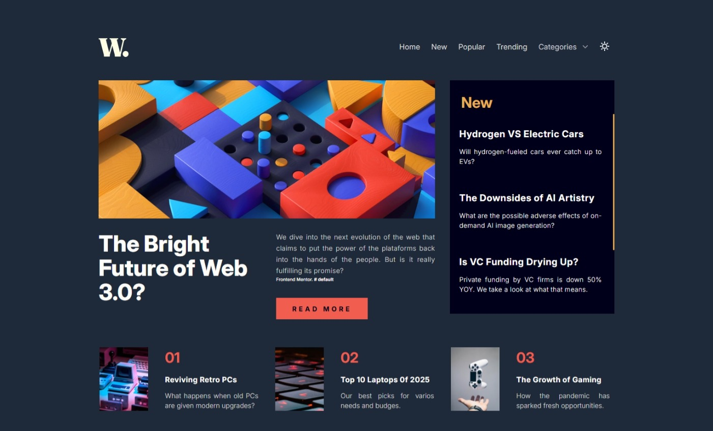
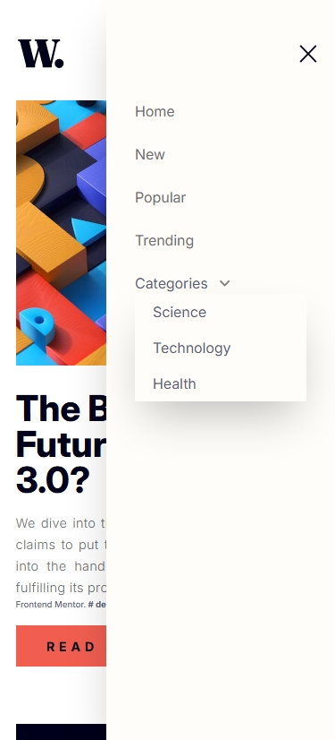
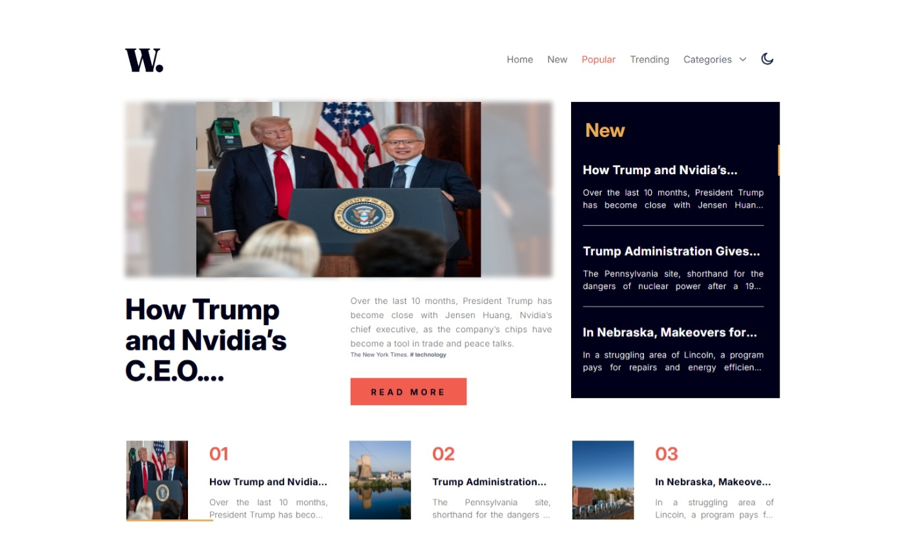

# Frontend Mentor - News homepage solution

This is a solution to the [News homepage challenge on Frontend Mentor](https://www.frontendmentor.io/challenges/news-homepage-H6SWTa1MFl). Frontend Mentor challenges help you improve your coding skills by building realistic projects. 

## Table of contents

- [Overview](#overview)
  - [The challenge](#the-challenge)
  - [Screenshot](#screenshot)
  - [Links](#links)
- [My process](#my-process)
  - [Built with](#built-with)
  - [What I learned](#what-i-learned)
  - [Continued development](#continued-development)
  - [Useful resources](#useful-resources)
- [Author](#author)
- [Acknowledgments](#acknowledgments)

## Overview

### The Frontend challenge

Users should be able to:

- View the optimal layout for the interface depending on their device's screen size
- See hover and focus states for all interactive elements on the page.

### Brief's personal project: News App
### 🎯 Objective
Build an application that consumes a public news API and displays headlines in a clear interface, with well-defined search and error/loading states.

### 📦 Requirements
# Main Hook (useNewsFeed)
* Returns {articles, error, loading}.

* Normalizes each article to {title, description, image, url}.

# NewsList Component
* Renders cards with title, image, and link.

* Handles loading and error states.

# Search
* NavBar to filter headlines by keyword.

# Fallback
* If the API fails, displays a clear message and a set of sample articles.

# UI/UX
* Scroll snapping to navigate between articles.

* Hover effects on cards.

## 🔧 Suggested API
* Mediastack: https://mediastack.com

### Screenshot

<p align="center" justify="start">
  
  &nbsp;&nbsp;&nbsp;&nbsp;&nbsp;&nbsp;
  
  &nbsp;&nbsp;&nbsp;&nbsp;&nbsp;&nbsp;
  
  &nbsp;&nbsp;&nbsp;&nbsp;&nbsp;&nbsp;
  
    &nbsp;&nbsp;&nbsp;&nbsp;&nbsp;&nbsp;
  
    &nbsp;&nbsp;&nbsp;&nbsp;&nbsp;&nbsp;
  
</p>

## Author

- Website - [Carla Johanna](https://github.com/devcjoha)
- Frontend Mentor - [@devcjoha](https://www.frontendmentor.io/profile/devcjoha)
- X - [@CarlitaJohanna](https://www.x.com/carlitajohana)


## 🚀 Live Deploys

- Solution URL: [code](https://github.com/devcjoha/app-news)
- Live Site URL: [Deploy-Github-Pages]()


## My process

### Built with

<p align="center">

 &nbsp;&nbsp;&nbsp;&nbsp;&nbsp;&nbsp;

 &nbsp;&nbsp;&nbsp;&nbsp;&nbsp;&nbsp;

 &nbsp;&nbsp;&nbsp;&nbsp;&nbsp;&nbsp;

 &nbsp;&nbsp;&nbsp;&nbsp;&nbsp;&nbsp;

 &nbsp;&nbsp;&nbsp;&nbsp;&nbsp;&nbsp;

 &nbsp;&nbsp;&nbsp;&nbsp;&nbsp;&nbsp;

</p>

- React (component-based architecture).
- Vite (development and packaging).
- Functional components and hooks (useState, useEffect, UseMemo, useRef).
- Tailwind custom propertie, theme dark/light.
- Responsive design.


### 👩🏻‍🦱 What I learned
* How to structure a custom hook (`useNewsFeed`) to normalize data and handle loading and error states.

* The importance of differentiating clear and accessible error messages in the UI.

* Fine-tuning with Tailwind (`line-clamp`, `leading`, `dark:`) to achieve visual consistency across different breakpoints.

* I reinforced how to integrate hover/focus states and scroll snapping to improve the user experience.


### 💥 Continued development
* Explore Next.js for SSR/SSG and improve SEO in future projects.

* Delve deeper into accessibility (roles, aria-labels, focus management).

* Document each project with use cases and technical decisions to strengthen the portfolio.

### 🔗 Useful resources
* Tailwind docs
* GitHub Pages deployment guides
* Vite + React integration tips

## 🚀 Deployment & Environment Setup

### ⚙️ Scripts disponibles

```bash
# Ejecuta el proyecto en desarrollo local
npm run dev

# Build estándar (no recomendado para GitHub Pages)
npm run build

# Build para GitHub Pages (usa base name correcto)
npm run build:gh

# Vista previa del build
npm run preview
```


## Author

- Website - [Carla Johanna](https://github.com/devcjoha)
- Frontend Mentor - [@devcjoha](https://www.frontendmentor.io/profile/devcjoha)
- X - [@CarlitaJohanna](https://www.x.com/carlitajohana)